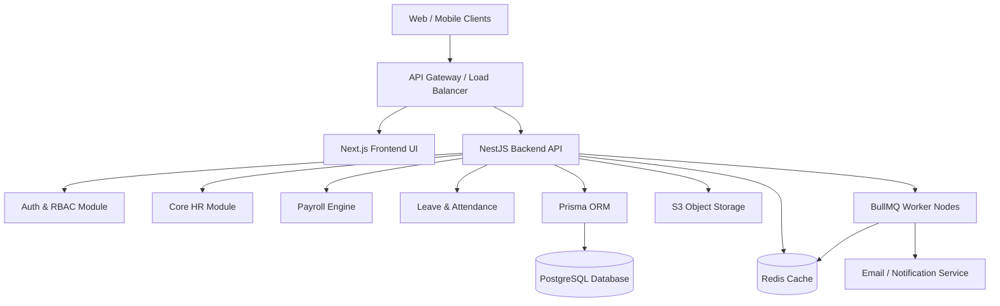

# Kenzo HRMS - Architecture Overview

## 1. System Architecture

## 2. Frontend Architecture (Next.js 15)
- **Framework:** Next.js 15 utilizing the App Router.
- **State Management:** React Query for server state caching; Zustand for local client state.
- **Styling:** TailwindCSS with shadcn/ui for accessible, reusable components.
- **Module Structure:** Feature-driven architecture (e.g., `features/attendance`, `features/payroll`).

## 3. Backend Architecture (NestJS)
- **Framework:** NestJS providing a highly testable, scalable, loosely coupled, and easily maintainable structure.
- **Pattern:** Modular Monolith transitioning to microservices if required.
- **Design Philosophy:** Clean Architecture.
  - **Controllers:** Handle HTTP requests and responses.
  - **Services (Use Cases):** Contain business logic.
  - **Repositories (Data Access):** Abstract database interactions via Prisma.
- **Multi-Tenancy:** Implemented using tenant IDs on every table. Request scoped providers in NestJS inject the current `tenantId` into Prisma calls.

## 4. Database Architecture
- **Engine:** PostgreSQL 16+.
- **ORM:** Prisma Client for type-safe database access.
- **Multi-Tenant Strategy:** Logical separation (Row-level isolation). Every query implicitly filters by `tenant_id`.
- **Migrations:** Managed via Prisma Migrate.

## 5. Infrastructure
- **Containerization:** Docker for consistent dev, test, and prod environments.
- **Orchestration:** Kubernetes (EKS/GKE) or AWS ECS.
- **CI/CD:** GitHub Actions for automated testing, building, and deployment.
- **Cache & Queues:** Redis used for caching frequent lookups (e.g., RBAC policies) and managing background queues (e.g., PDF payslip generation).

## 6. Security Architecture
- **Authentication:** JWT-based stateless authentication.
- **Data Protection:** Secrets stored in HashiCorp Vault or AWS Secrets Manager. Database encryption at rest.
- **API Security:** Helmet for security headers, strict CORS policies, and rate limiting via Redis.

## 7. Integration Points
- **Webhooks:** Outbound webhooks for ERP/Accounting system integrations.
- **SSO:** SAML/OAuth2 support for Google Workspace and Microsoft Entra ID.
- **Biometric Devices:** REST/MQTT endpoints for hardware attendance punch sync.
