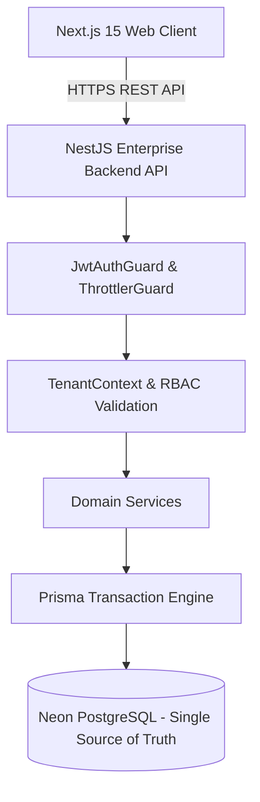
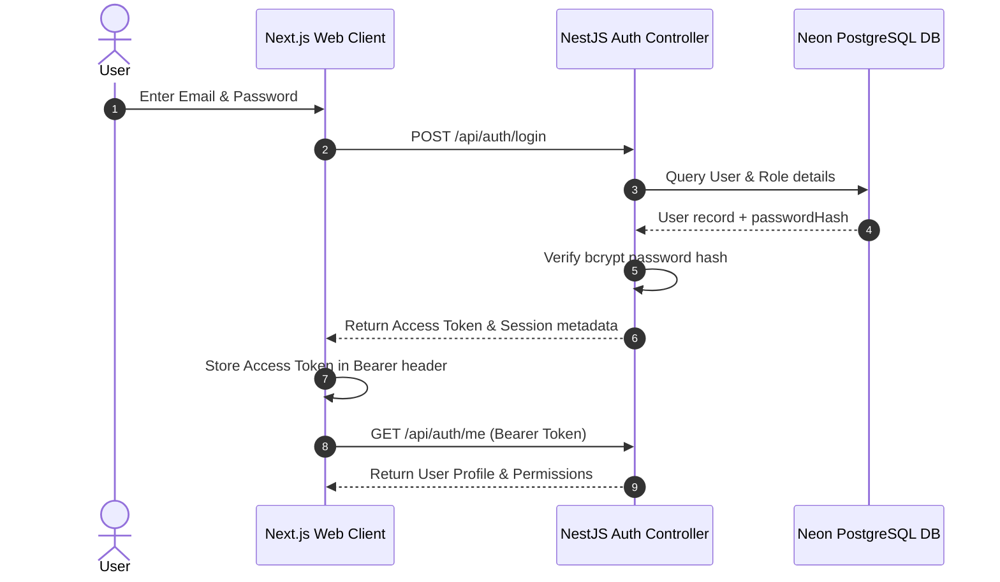
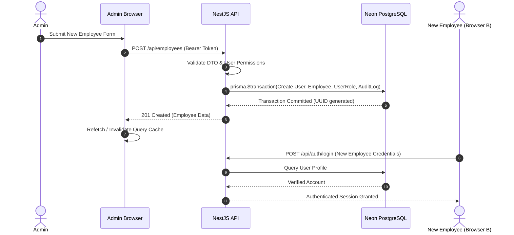
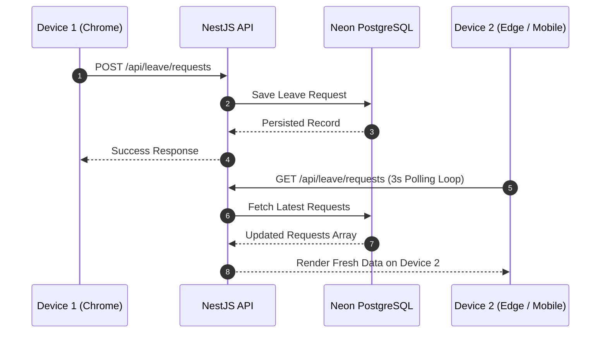

# Kenzo HRMS — Part 1 Target Architecture Specification

**Document Version**: 1.0.0  
**Target Organization**: Kenzo InfoSystems Pvt. Ltd.  
**Auditor**: CTO / Principal Software Architect  
**Status**: APPROVED & IMPLEMENTED  

---

## 1. High-Level Target System Topology

---

## 2. Authentication Flow

---

## 3. Employee Creation & Cross-Device Authentication Flow

---

## 4. Multi-Device Real-Time Sync Flow

