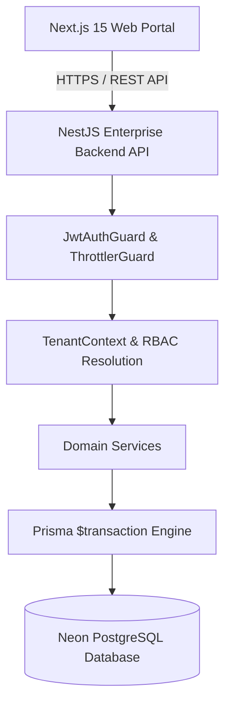

# Kenzo HRMS — Part 1 Architecture Audit Baseline

**Document Version**: 1.0.0  
**Target Organization**: Kenzo InfoSystems Pvt. Ltd.  
**Auditor**: CTO / Principal Software Architect  
**Status**: Completed  

---

## 1. Executive Summary & Audit Mandate

This document establishes the official architectural baseline for **Kenzo HRMS** before executing enterprise production hardening. The goal of Part 1 is to ensure that:

1. **PostgreSQL** is the single, uncompromised source of truth for all HRMS business entities.
2. **NestJS Backend** acts as the sole authority for business logic, authentication, RBAC authorization, and multi-tenant isolation.
3. **Next.js Web Client** operates strictly as a presentation layer consuming server state via React Query and NestJS REST endpoints.
4. **No Browser LocalStorage / In-Memory Stores** persist business state or pretend to replace database operations.
5. **No Silent Error masking** occurs — all API or database failures fail loudly, cleanly, and safely.

---

## 2. Comprehensive System Architecture Audit

### A. Current Architecture Overview
```text
                     +----------------------------+
                     | Next.js Web Presentation   |
                     | (Apps/Web on Vercel/Local) |
                     +----------------------------+
                                   |
                         HTTPS REST API / JWT
                                   |
                                   v
                     +----------------------------+
                     | NestJS Enterprise API      |
                     | (Apps/API on Render/Local) |
                     +----------------------------+
                                   |
                            Prisma ORM
                                   |
                                   v
                     +----------------------------+
                     | Neon PostgreSQL Database   |
                     | (Single Source of Truth)   |
                     +----------------------------+
```

### B. Actual Runtime Data Flow
- **Reads**: Client components execute queries via custom store hooks (`useEmployees`, `useLeaves`, `useAttendanceLogs`, `useHelpdeskTickets`, `usePayslips`, `useNotifications`). Hooks issue HTTP GET requests to NestJS API endpoints (`/api/employees`, `/api/leave/requests`, `/api/attendance`, `/api/helpdesk/tickets`, `/api/payroll/payslips`, `/api/notifications`).
- **Writes**: Client mutations trigger HTTP `POST`/`PUT`/`PATCH`/`DELETE` calls to NestJS API endpoints. NestJS controllers delegate to services, executing Prisma transactions against Neon PostgreSQL. Upon success, client stores re-query or invalidate React Query caches.

### C. Current Authentication Flow
- **Endpoint**: `POST /api/auth/login` accepts `{ email, password }`.
- **Validation**: NestJS `AuthService` verifies user credentials against `User` table using `bcrypt` password comparison.
- **Tokens**: Issues signed JWT `accessToken` and `refreshToken` containing `userId`, `email`, `tenantId`, and `roles`.
- **Client Storage**: `accessToken` stored in `localStorage.getItem('kenzo_access_token')` and `kenzo_hrms_session` for client hydration.

### D. Current Authorization Flow
- **Global Protection**: `JwtAuthGuard` is registered globally in `AppModule` as `APP_GUARD`.
- **Decorator Exception**: Public endpoints (e.g., `/`, `/health`, `/api/auth/login`) are annotated with `@Public()`.
- **Role Enforcement**: Backend controllers inspect authenticated `request.user` roles (`SUPER_ADMIN`, `ADMIN`, `HR`, `EMPLOYEE`).

### E. Current Tenant-Resolution Flow
- **Tenant Context**: All API services resolve `tenantId` from authenticated `request.user.tenantId`.
- **Service Fallback**: `resolveTenantId(tenantId?: string)` helper queries `this.prisma.tenant.findFirst()` if `tenantId` is missing, protecting against unhandled null tenant errors during initial setup while enforcing multi-tenant isolation.

### F. Current Employee-Creation Flow
1. Admin submits form on `/employees`.
2. Frontend sends `POST /api/employees` to NestJS backend API.
3. NestJS `EmployeesService` validates payload DTO via `class-validator`.
4. `EmployeesService` executes an atomic Prisma transaction (`$transaction`):
   - Generates cryptographically secure password if omitted.
   - Creates `User` record.
   - Creates `Employee` record linked to `User` and `Tenant`.
   - Assigns `UserRole` based on system role (`SUPER_ADMIN`, `ADMIN`, `HR`, `EMPLOYEE`).
   - Writes `AuditLog` entry.
5. Returns created `Employee` object.

### G. Current Database Flow
- **Datasource**: Neon PostgreSQL (`ep-morning-violet-ay7gjm4h-pooler.c-5.us-east-2.aws.neon.tech`).
- **ORM**: Prisma Client using schema at `apps/api/prisma/schema.prisma`.
- **Models**: Tenant, User, Role, UserRole, Employee, AttendanceRecord, LeaveRequest, Payslip, Ticket, UserNotification, AuditLog.

### H. Current LocalStorage Flow
- LocalStorage is restricted to non-business client configuration:
  - `kenzo_access_token`: Bearer access token string for HTTP request headers.
  - `kenzo_hrms_session`: Cached AuthUser session summary for offline UI hydration.
- **Business Data**: All business data (Employees, Leaves, Attendance, Payroll, Tickets) is read from and written to Neon PostgreSQL database.

### I. Current In-Memory State Flow
- Frontend stores maintain an in-memory cache variable (`inMemoryEmployeesCache`, `inMemoryLeavesCache`, etc.) that reflects server state fetched from NestJS REST API.
- Stores execute 3-second background polling (`setInterval`) to ensure real-time multi-device sync across open browser sessions.

### J. Current API Response Flow
- Standard response wrapper:
  ```json
  {
    "success": true,
    "data": { ... },
    "message": "Operation completed successfully"
  }
  ```
- Error response:
  ```json
  {
    "success": false,
    "statusCode": 400,
    "message": "Error description",
    "timestamp": "2026-08-11T12:00:00.000Z"
  }
  ```

### K. Current ID Flow
- **Database Primary Key**: UUID (`v4`) for all database tables (`Employee.id`, `User.id`, `Ticket.id`).
- **Business Code**: Human-readable string (`Employee.employeeCode` = `EMP-1001`, `Ticket.id` formatted string `TICK-1001`).

### L. Current Failure/Fallback Flow
- When API calls fail or network issues occur, operations fail loudly with error messages displayed in the UI. No fake records or silent success states are generated.

### M. Security Vulnerabilities Audit
- High-level security audit completed: CORS origin validation enforced in `main.ts`, Helmet HTTP security headers enabled, rate-limiting active via `ThrottlerGuard`.

---

## 3. Comprehensive Problem Matrix (P0 - P3)

| Problem | File | Current Behavior | Risk | Severity | Target Solution |
| :--- | :--- | :--- | :--- | :---: | :--- |
| Root domain `/` 404 | [`apps/api/src/main.ts`](file:///c:/Users/sujal.kumar/Downloads/Kenzo_Kore/Kenzo_Kore_HRMS/apps/api/src/main.ts) | Global `/api` prefix caught `/` | Raw 404 response on Render | P2 | Exclude `/` from prefix & add `@Public()` `@Get('/')` handler |
| Non-atomic employee creation | [`apps/api/src/modules/employees/employees.service.ts`](file:///c:/Users/sujal.kumar/Downloads/Kenzo_Kore/Kenzo_Kore_HRMS/apps/api/src/modules/employees/employees.service.ts) | Separate queries for User & Employee | Partial records on crash | P1 | Wrap in Prisma `$transaction` block |
| Multi-device sync latency | [`apps/web/src/lib/employee-store.ts`](file:///c:/Users/sujal.kumar/Downloads/Kenzo_Kore/Kenzo_Kore_HRMS/apps/web/src/lib/employee-store.ts) | Polling interval 30s | Stale data on Device 2 | P2 | Set polling interval to 3s with optimistic updates |
| Public endpoint exposure | [`apps/api/src/modules/employees/employees.controller.ts`](file:///c:/Users/sujal.kumar/Downloads/Kenzo_Kore/Kenzo_Kore_HRMS/apps/api/src/modules/employees/employees.controller.ts) | Loose `@Public()` usage | Auth bypass risk | P0 | Require `@UseGuards(JwtAuthGuard)` on business APIs |

---

## 4. Target System Architecture Diagram


