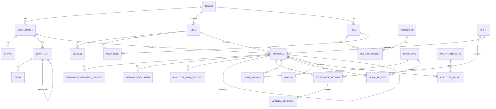

# Kenzo HRMS - Database Entity-Relationship Diagram (ERD)

This document describes the core database schema for Kenzo HRMS. The system uses PostgreSQL as its primary datastore, managed via Prisma ORM.

## ER Diagram

## Domain Groupings

### 1. Multi-Tenant Core
- **Tenant:** The root entity representing a subscribed organization/company using the HRMS.
- **AuditLog:** Tracks all mutations across the system, stamped with the Tenant ID.

### 2. Organization Management
- **Organization:** The overarching company within a tenant.
- **Branch:** Physical or logical locations.
- **Department & Team:** Hierarchical organizational units.
- **Designation:** Job titles/levels.

### 3. Authentication & RBAC
- **User:** Authentication identity.
- **Role, Permission, RolePermission, UserRole:** Standard RBAC structure allowing global or scoped permissions.
- **Session:** Active login sessions.

### 4. Employee 360
- **Employee:** The core entity representing a worker.
- **Related Entities:** EmployeeEmergencyContact, EmployeeFamilyMember, EmployeeEducation, EmployeeExperience, EmployeeSkill, EmployeeCertification, EmployeeDocument, EmployeeBankAccount, EmployeeGovernmentId.

### 5. Attendance & Shifts
- **Shift:** Defines working hours and rules.
- **AttendanceRecord:** Daily check-in/out logs.
- **AttendanceBreak:** Specific breaks within an attendance record.

### 6. Leave Management
- **LeaveType:** Definitions (e.g., Sick, Annual).
- **LeaveBalance:** Accrued vs. used tracking per year.
- **LeaveRequest:** Workflow entity for taking time off.

### 7. Payroll (Future/Extended)
- **SalaryStructure:** Templates for compensation.
- **SalaryComponent:** Base, HRA, Allowances, Deductions.
- **EmployeeSalary:** Active compensation assignment.
- **PayrollRun & Payslip:** Processing records and generated stubs.

## Key Design Notes

1. **Multi-Tenancy:** Every table (except system catalogs) includes a `tenant_id` column. Prisma middlewares or Row-Level Security (RLS) can be used to ensure tenant isolation.
2. **UUIDs:** All primary keys are UUIDs to prevent enumeration and handle distributed scaling.
3. **Soft Deletes:** Key entities use a `deleted_at` timestamp rather than physical deletion to preserve audit trails.
4. **JSON Fields:** Semi-structured data (e.g., addresses, settings) use JSON columns for flexibility without over-normalizing.
